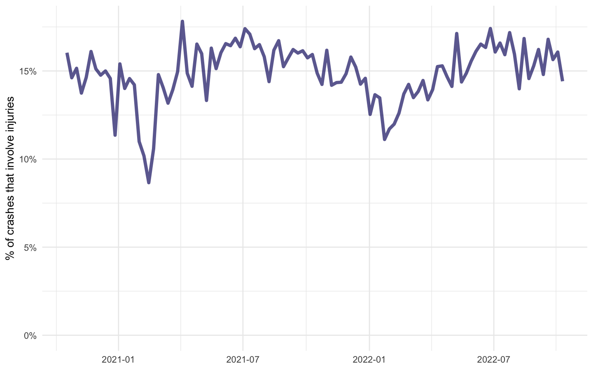
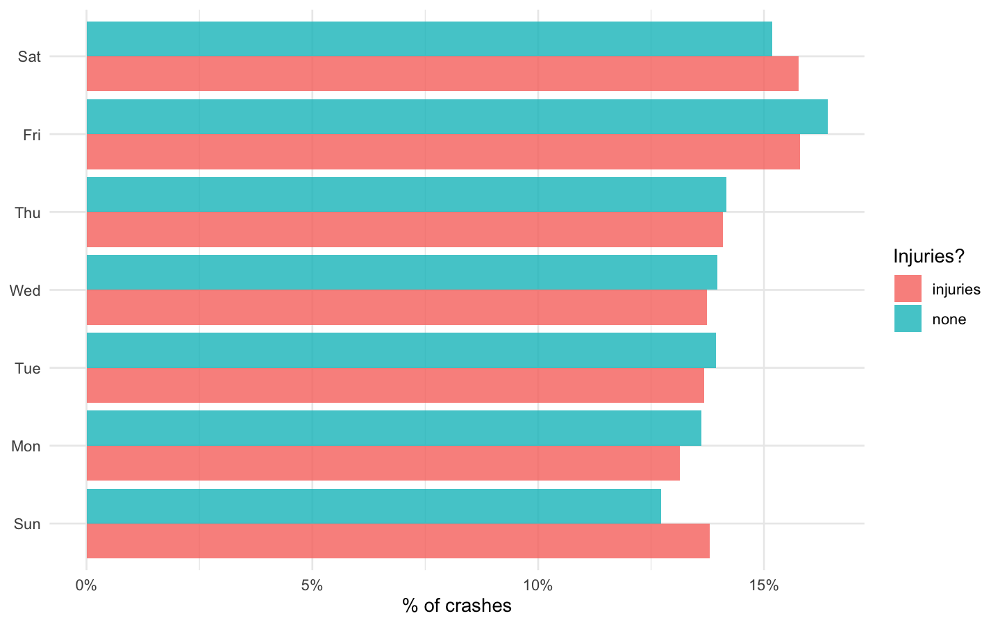
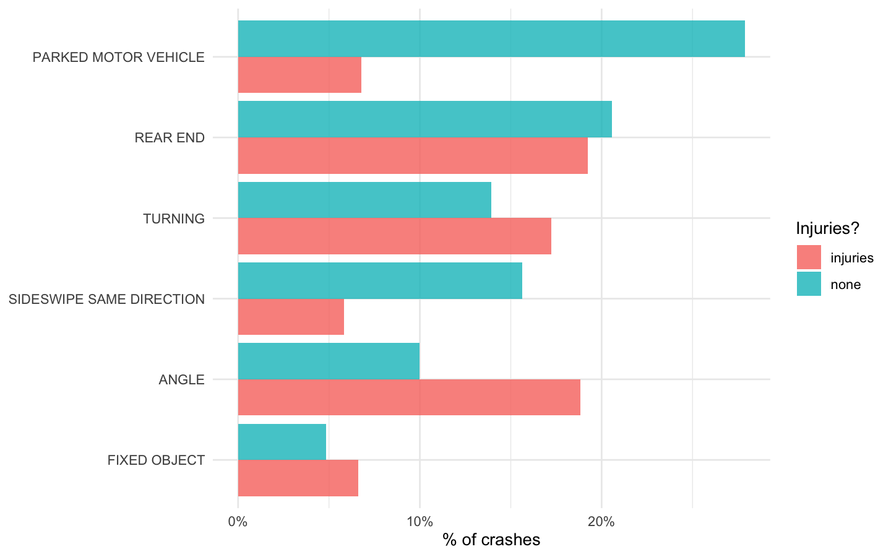
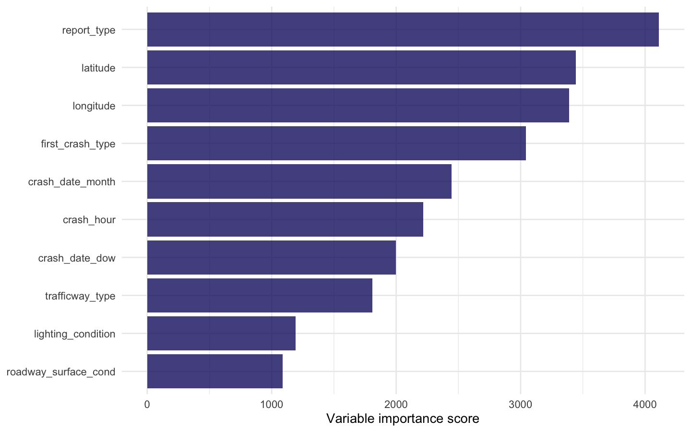
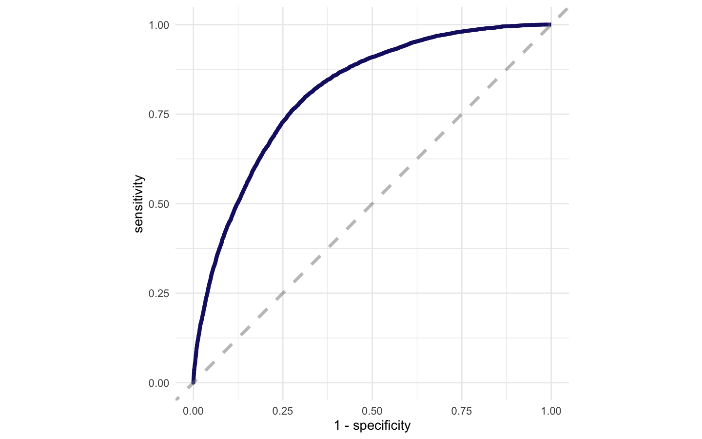

Let's build a model for [traffic crashes in Chicago](https://data.cityofchicago.org/Transportation/Traffic-Crashes-Crashes/85ca-t3if). We can build a model to predict whether a crash involved an injury or not.

## Explore data

[This dataset](https://data.cityofchicago.org/Transportation/Traffic-Crashes-Crashes/85ca-t3if) covers traffic crashes on city streets within Chicago city limits under the jurisdiction of the Chicago Police Department.

> All crashes are recorded as per the format specified in the Traffic Crash Report, SR1050, of the Illinois Department of Transportation. As per Illinois statute, only crashes with a property damage value of $1,500 or more or involving bodily injury to any person(s) and that happen on a public roadway and that involve at least one moving vehicle, except bike dooring, are considered reportable crashes. However, CPD records every reported traffic crash event, regardless of the statute of limitations, and hence any formal Chicago crash dataset released by Illinois Department of Transportation may not include all the crashes listed here.

Let's download the last two years of data to train our model.


```r
library(tidyverse)
library(lubridate)
library(RSocrata)

years_ago <- today() - years(2)
crash_url <- glue::glue("https://data.cityofchicago.org/Transportation/Traffic-Crashes-Crashes/85ca-t3if?$where=CRASH_DATE > '{years_ago}'")
crash_raw <- as_tibble(read.socrata(crash_url))

crash <- crash_raw %>%
  arrange(desc(crash_date)) %>%
  transmute(injuries = if_else(injuries_total > 0, "injuries", "none"),
            crash_date,
            crash_hour,
            report_type = if_else(report_type == "", "UNKNOWN", report_type),
            num_units,
            posted_speed_limit,
            weather_condition,
            lighting_condition,
            roadway_surface_cond,
            first_crash_type,
            trafficway_type,
            prim_contributory_cause,
            latitude, longitude) %>%
  na.omit()
```


```r
library(lubridate)
crash %>%
  mutate(crash_date = floor_date(crash_date, unit = "week")) %>%
  count(crash_date, injuries) %>%
  filter(crash_date != last(crash_date),
         crash_date != first(crash_date)) %>%
  ggplot(aes(crash_date, n, color = injuries)) +
  geom_line(size = 1.5, alpha = 0.7) +
  scale_y_continuous(limits = (c(0, NA))) +
  labs(x = NULL, y = "Number of traffic crashes per week",
       color = "Injuries?")
```


Ah, 2020!

How has the injury rate changed over time?


```r
crash %>%
  mutate(crash_date = floor_date(crash_date, unit = "week")) %>%
  count(crash_date, injuries) %>%
  filter(crash_date != last(crash_date),
         crash_date != first(crash_date)) %>%
  group_by(crash_date) %>%
  mutate(percent_injury = n / sum(n)) %>%
  ungroup() %>%
  filter(injuries == "injuries") %>%
  ggplot(aes(crash_date, percent_injury)) +
  geom_line(size = 1.5, alpha = 0.7, color = "midnightblue") +
  scale_y_continuous(limits = c(0, NA), labels = percent_format()) +
  labs(x = NULL, y = "% of crashes that involve injuries")
```



How does the injury rate change through the week?


```r
crash %>%
  mutate(crash_date = wday(crash_date, label = TRUE)) %>%
  count(crash_date, injuries) %>%
  group_by(injuries) %>%
  mutate(percent = n / sum(n)) %>%
  ungroup() %>%
  ggplot(aes(percent, crash_date, fill = injuries)) +
  geom_col(position = "dodge", alpha = 0.8) +
  scale_x_continuous(labels = percent_format()) +
  labs(x = "% of crashes", y = NULL, fill = "Injuries?")
```



How do injuries vary with first crash type?


```r
crash %>%
  count(first_crash_type, injuries) %>%
  mutate(first_crash_type = fct_reorder(first_crash_type, n)) %>%
  group_by(injuries) %>%
  mutate(percent = n / sum(n)) %>%
  ungroup() %>%
  group_by(first_crash_type) %>%
  filter(sum(n) > 1e4) %>%
  ungroup() %>%
  ggplot(aes(percent, first_crash_type, fill = injuries)) +
  geom_col(position = "dodge", alpha = 0.8) +
  scale_x_continuous(labels = percent_format()) +
  labs(x = "% of crashes", y = NULL, fill = "Injuries?")
```



Are injuries more likely in different locations?


```r
crash %>%
  filter(latitude > 0) %>%
  ggplot(aes(longitude, latitude, color = injuries)) +
  geom_point(size = 0.5, alpha = 0.4) +
  labs(color = NULL) +
  scale_color_manual(values = c("deeppink4", "gray80")) +
  coord_fixed()
```


## Build a model

Let's start by splitting our data and creating cross-validation folds.


```r
library(tidymodels)

set.seed(2020)
crash_split <- initial_split(crash, strata = injuries)
crash_train <- training(crash_split)
crash_test  <- testing(crash_split)

set.seed(123)
crash_folds <- vfold_cv(crash_train, strata = injuries)
crash_folds
```

```
## #  10-fold cross-validation using stratification 
## # A tibble: 10 x 2
##    splits                 id    
##    <list>                 <chr> 
##  1 <split [140.3K/15.6K]> Fold01
##  2 <split [140.3K/15.6K]> Fold02
##  3 <split [140.3K/15.6K]> Fold03
##  4 <split [140.3K/15.6K]> Fold04
##  5 <split [140.3K/15.6K]> Fold05
##  6 <split [140.3K/15.6K]> Fold06
##  7 <split [140.3K/15.6K]> Fold07
##  8 <split [140.3K/15.6K]> Fold08
##  9 <split [140.3K/15.6K]> Fold09
## 10 <split [140.3K/15.6K]> Fold10
```

Next, let's create a model. 

- The feature engineering includes creating date features such as day of the week, handling the high cardinality of weather conditions, contributing cause, etc, and perhaps most importantly, downsampling to account for the class imbalance (injuries are more rare than non-injury-causing crashes).
- After experimenting with random forests and xgboost, this smaller bagged tree model achieved very nearly the same performance with a much smaller model "footprint" in terms of model size and prediction time.


```r
library(themis)
library(textrecipes)
library(baguette)

crash_rec <- recipe(injuries ~ ., data = crash_train) %>%
  step_date(crash_date) %>%  
  step_rm(crash_date) %>%
  step_other(weather_condition, first_crash_type, 
             trafficway_type, prim_contributory_cause,
             other = "OTHER") %>%
  step_clean_levels(all_nominal(), -injuries) %>%
  step_downsample(injuries)

bag_spec <- bag_tree(min_n = 10) %>% 
  set_engine("rpart", times = 25) %>%
  set_mode("classification")

crash_wf <- workflow() %>%
  add_recipe(crash_rec) %>%
  add_model(bag_spec)

crash_wf
```

```
## ══ Workflow ══════════════════════════════════════════════════════════════════════════════
## Preprocessor: Recipe
## Model: bag_tree()
## 
## ── Preprocessor ──────────────────────────────────────────────────────────────────────────
## 5 Recipe Steps
## 
## ● step_date()
## ● step_rm()
## ● step_other()
## ● step_clean_levels()
## ● step_downsample()
## 
## ── Model ─────────────────────────────────────────────────────────────────────────────────
## Bagged Decision Tree Model Specification (classification)
## 
## Main Arguments:
##   cost_complexity = 0
##   min_n = 10
## 
## Engine-Specific Arguments:
##   times = 25
## 
## Computational engine: rpart
```

Let's fit this model to the cross-validation resamples to understand how well it will perform.


```r
doParallel::registerDoParallel()
crash_res <- fit_resamples(
  crash_wf,
  crash_folds,
  control = control_resamples(save_pred = TRUE)
)
```


## Evaluate model

What do the results look like?


```r
collect_metrics(crash_res)
```

```
## # A tibble: 2 x 6
##   .metric  .estimator  mean     n std_err .config             
##   <chr>    <chr>      <dbl> <int>   <dbl> <chr>               
## 1 accuracy binary     0.726    10 0.00122 Preprocessor1_Model1
## 2 roc_auc  binary     0.820    10 0.00154 Preprocessor1_Model1
```

This is almost exactly what we achieved with models like random forest and xgboost, and looks to be about as good as we can do with this data.

Let's now **fit** to the entire training set and **evaluate** on the testing set.


```r
crash_fit <- last_fit(crash_wf, crash_split)
collect_metrics(crash_fit)
```

```
## # A tibble: 2 x 4
##   .metric  .estimator .estimate .config             
##   <chr>    <chr>          <dbl> <chr>               
## 1 accuracy binary         0.728 Preprocessor1_Model1
## 2 roc_auc  binary         0.819 Preprocessor1_Model1
```

Which features were most important in predicting an injury?


```r
crash_imp <- crash_fit$.workflow[[1]] %>%
  pull_workflow_fit()

crash_imp$fit$imp %>%
  slice_max(value, n = 10) %>%
  ggplot(aes(value, fct_reorder(term, value))) +
  geom_col(alpha = 0.8, fill = "midnightblue") +
  labs(x = "Variable importance score", y = NULL)
```



How does the ROC curve look?


```r
collect_predictions(crash_fit) %>%
  group_by(id) %>%
  roc_curve(injuries, .pred_injuries) %>%
  ggplot(aes(x = 1 - specificity, y = sensitivity)) +
  geom_line(size = 1.5, color = "midnightblue") +
  geom_abline(
    lty = 2, alpha = 0.5,
    color = "gray50",
    size = 1.2
  ) +
  coord_equal()
```



## Save model

We are happy with this model, so we need to save (serialize) it to be used in our model API. We can [`butcher()` the model](https://tidymodels.github.io/butcher/) to make it as small as possible. This does not affect the predictions.


```r
crash_wf_model <- butcher::butcher(crash_fit$.workflow[[1]])
predict(crash_fit$.workflow[[1]], crash_test[222,])
```

```
## # A tibble: 1 x 1
##   .pred_class
##   <fct>      
## 1 none
```

```r
predict(crash_wf_model, crash_test[222,])
```

```
## # A tibble: 1 x 1
##   .pred_class
##   <fct>      
## 1 none
```

This model is already pretty streamlined so it doesn't make a huge difference, but every little bit helps!


```r
lobstr::obj_size(crash_fit$.workflow[[1]])
```

```
## 97,980,376 B
```

```r
lobstr::obj_size(crash_wf_model)
```

```
## 97,980,376 B
```

Now let's save this model and the metrics to be used later.


```r
saveRDS(crash_wf_model, here::here("crash-api", "crash-wf-model.rds"))
write_csv(collect_metrics(crash_res), here::here("crash-api", "crash-model-metrics.csv"))
```
